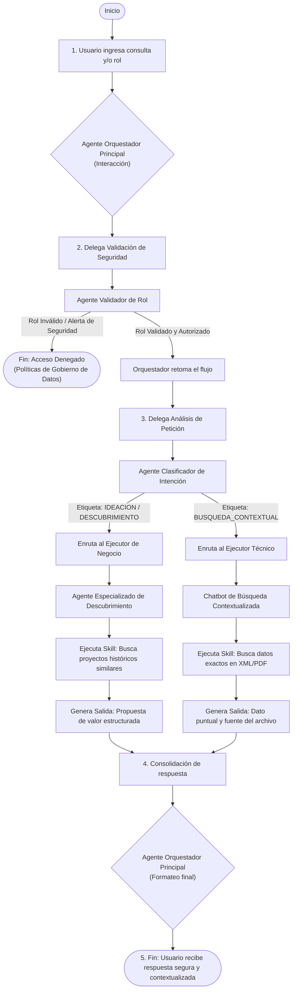

```mermaid
flowchart TD
    Inicio([Inicio]) --> Consulta["1. Usuario ingresa consulta y/o rol"]
    
    Consulta --> Orquestador{"Agente Orquestador Principal\n(Interacción)"}
    
    Orquestador --> Delegacion1["2. Delega Validación de Seguridad"]
    Delegacion1 --> Validador["Agente Validador de Rol"]
    
    Validador -- "Rol Inválido / Alerta de Seguridad" --> Denegado(["Fin: Acceso Denegado\n(Políticas de Gobierno de Datos)"])
    Validador -- "Rol Validado y Autorizado" --> OrquestadorRet1["Orquestador retoma el flujo"]
    
    OrquestadorRet1 --> Delegacion2["3. Delega Análisis de Petición"]
    Delegacion2 --> Clasificador["Agente Clasificador de Intención"]
    
    Clasificador -- "Etiqueta: IDEACION / DESCUBRIMIENTO" --> EnrutamientoA["Enruta al Ejecutor de Negocio"]
    Clasificador -- "Etiqueta: BUSQUEDA_CONTEXTUAL" --> EnrutamientoB["Enruta al Ejecutor Técnico"]
    
    EnrutamientoA --> Descubrimiento["Agente Especializado de Descubrimiento"]
    EnrutamientoB --> Chatbot["Chatbot de Búsqueda Contextualizada"]
    
    Descubrimiento --> SkillA["Ejecuta Skill: Busca proyectos históricos similares"]
    SkillA --> SalidaA["Genera Salida: Propuesta de valor estructurada"]
    
    Chatbot --> SkillB["Ejecuta Skill: Busca datos exactos en XML/PDF"]
    SkillB --> SalidaB["Genera Salida: Dato puntual y fuente del archivo"]
    
    SalidaA --> Consolidacion["4. Consolidación de respuesta"]
    SalidaB --> Consolidacion
    
    Consolidacion --> OrquestadorFinal{"Agente Orquestador Principal\n(Formateo final)"}
    
    OrquestadorFinal --> Fin(["5. Fin: Usuario recibe respuesta segura y contextualizada"])
```